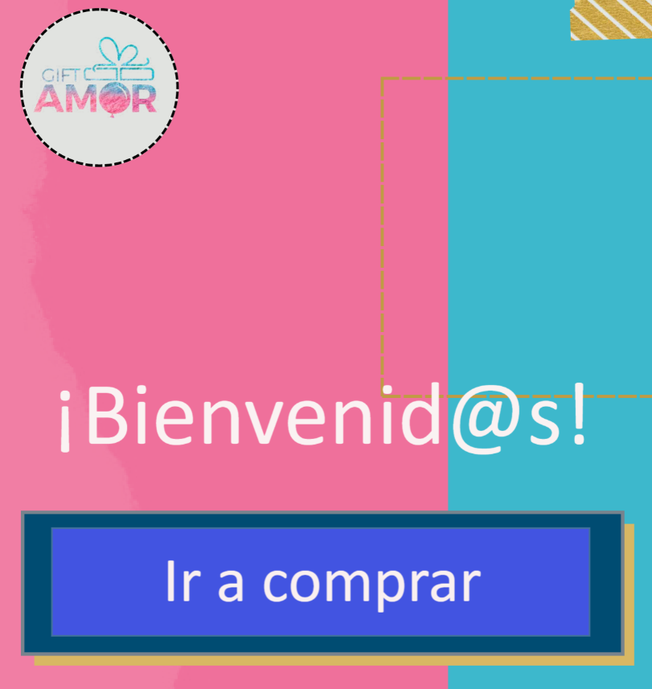
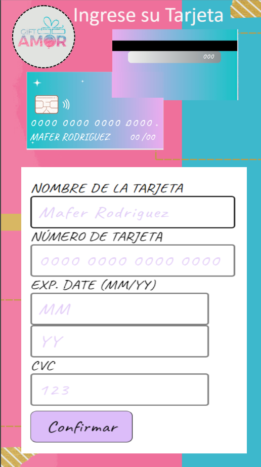
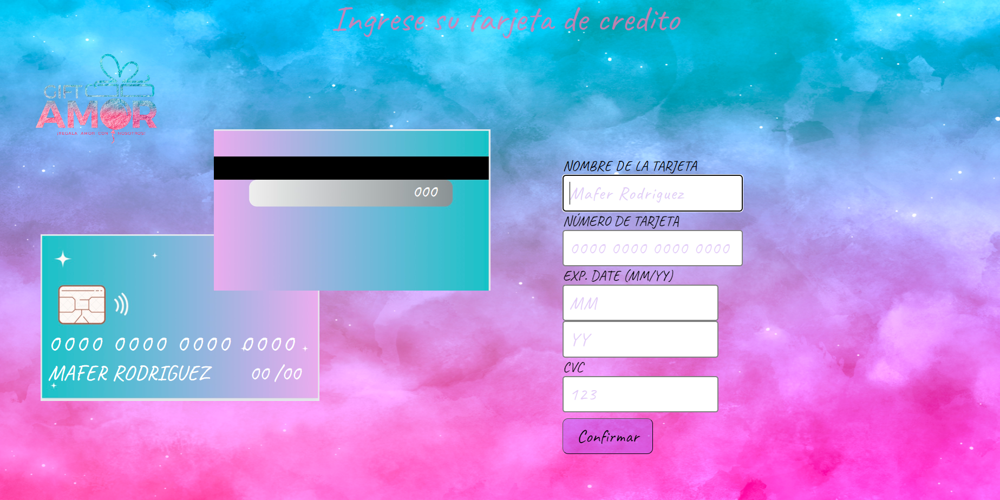
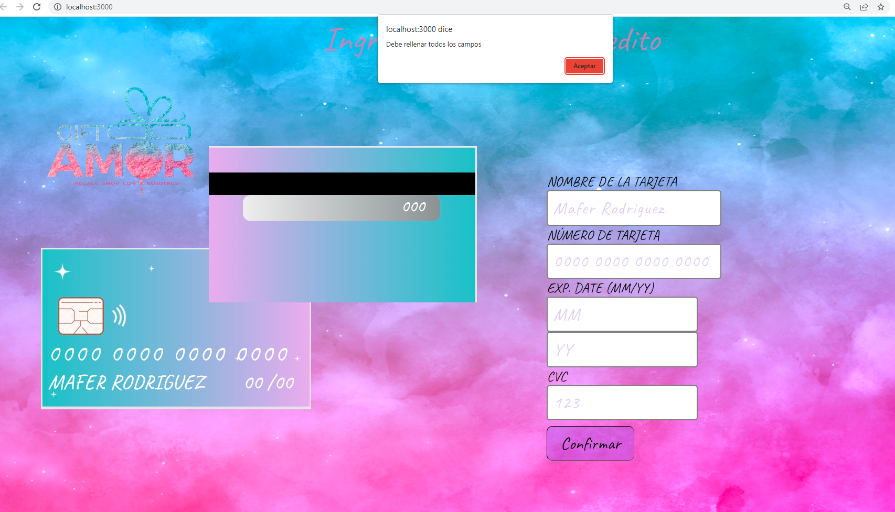

# Gift Amor.

Gift amor es una app que permite a los usuarios realizar compras de regalos personalizados para enviar a sus seres queridos y amigos. 

### Principales usuarios
Los principales usuarios de este producto son todas las personas que deseen regalar algún detalle 
para alguna ocación especial.
### Objetivos de los usuarios en relación a este producto.

El objetivo del usuario con esta interfaz es poder realizar la compra de un regalo personalizado con su tarjeta de credito
mediante esta app el usuario resuelve el problema de tener que ir a la tienda fisica a realizar su compra, lo cual le ahorra 
tiempo y le permite resolver rápidamente en caso de haber olvidado una fecha importante. 

### Prototipo. 

Al inicio de este proyecto la idea era crear una app en donde el usuario viera una pagina de bienvenida 

Que al darle continuar llevaría a nuestro usuario a la interfaz para poder seleccionar sus regalos

Una vez que seleccionara el regalo deseado y le diera continuar lo llevaria a nuestra plataforma de pago
donde podría ingresar su tarjeta de crédito para realizar su compra

De esta forma el usuario ingresaría su tarjeta y podría valida si el pago con su tarjeta es válido o inválido.

### Desiciones de diseño
Con el transcurrir de los dias se tomó la decisión de modificar la interfaz, debido a que se priorizaron los objetivos de aprendizaje propuestos 
en el proyecto Card Validation. 

Por lo cual se realizó una nueva y más sencilla interfaz que tiene como prioridad comprobar si una tarjeta de crédito es válida y mostrar al usuario
su tarjeta enmascarada a excepción de los últimos 4 números de su tarjeta. y así fue como quedó la interfaz final

 
 
 Esta interfaz le permite al usuario ver una pequeña imagen de una tarjeta en donde se va modificando la información de su tarjeta ingresada en el 
 formulario, lo cual le facilita poder ver si esta llenando los campos correctamente. 
 
 ### Funcionalidad 
 
 Una vez el usuario ha ingresado a la interfaz, puede empezar a ingresar su tarjeta de crédito, si el usuario olvida colocar alguno de los datos 
 en el formulario, al darle continuar le saldrá una alerta indicándole que debe rellenar todos los campos. 
 Lo cual se ve de esta manera: 
 
  
  
  Una vez el usuario haya ingresado sus datos correctamente, si su tarjeta es válida, la app les mostrará que su tarjeta ha sido validada y 
  los números de su tarjeta ingresada a excepción de los últimos digitos 4. Lo cual se ve de la siguiente manera: 
  
  
  
  
  Por el contrario si usuario ingresa una tarjeta de crédito inválida la interfaz le mostrará un mensaje diciendo ¡Error, Tarjeta inválida!, lo cual 
  le permitirá al usuario verificar sus datos e intentarlo nuevamente de ser necesario. 
  
   
 
 
 
 
